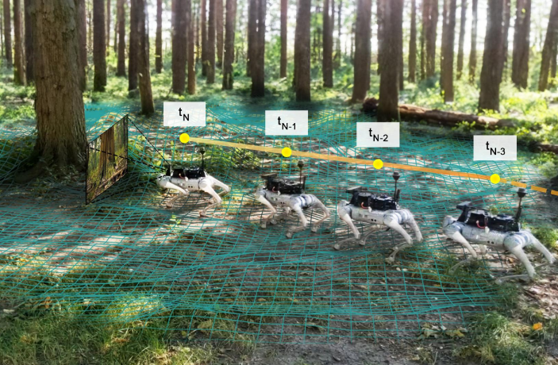
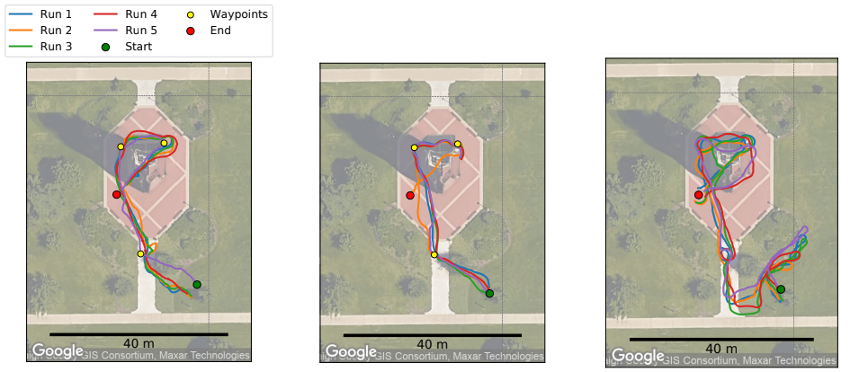

# WayFASTER: a Self-Supervised Traversability Prediction for Increased Navigation Awareness



## Introduction
The repository contains the code and trained models corresponding to the paper:

**WayFASTER: a Self-Supervised Traversability Prediction for Increased Navigation Awareness, [Mateus V. Gasparino](https://scholar.google.com/citations?user=UbtCA90AAAAJ&hl=en), [Arun N. Sivakumar](https://scholar.google.com/citations?user=peIOOn8AAAAJ&hl=en) and [Girish Chowdhary](https://scholar.google.com/citations?user=pf2zAXkAAAAJ&hl=en), ICRA 2024** [[Paper]]()

<p align="justify">
  We presented WayFASTER, a novel method for self-supervised traversability estimation that uses sequential information to predict a map that improves the traversability map visibility. For such, we use a neural network model that takes a sequence of RGB and depth images as input, and uses the camera’s intrinsic and extrinsic parameters to project the information to a 3D space and predict a 2D traversability map.
</p>

## Citation
If you find the code useful, please consider citing our paper using the following BibTeX entry.
```
@article{gasparino2024wayfaster,
  title={WayFASTER: a Self-Supervised Traversability Prediction for Increased Navigation Awareness},
  author={Gasparino, Mateus Valverde and Sivakumar, Arun Narenthiran and Chowdhary, Girish},
  journal={arXiv preprint arXiv:2402.00683},
  year={2024}
}
```

## System requirements
- Linux (Tested on Ubuntu 20.04)
- Python3 (Tested using Python 3.8) 
- PyTorch (Tested using Pytorch 2.2.2) 
- CUDA (Tested using CUDA 12.2)

## Installation
- Create a python virtual environment and activate it.
  ```shell
  python3 -m virtualenv env
  source env/bin/activate
  ```
- Install the dependencies using the provided `requirements.txt` file.
  ```shell
  pip3 install -r requirements.txt
  ```

## WayFASTER dataset
- Download the WayFASTER dataset by running the script inside this package:
  ```shell
  ./download_data.sh
  ```

## Code execution
### Configuration parameters and training
The configuration parameters of the model such as the learning rate, batch size, and dataloader options are stored in the `configs` folder.
If you intend to modify the model parameters, please do so here. Also, the training and evaluation scripts are stored in the same folder.

### Model and data handling
The network model is stored in the `wayfaster/models` folder.

To train the model, execute the following command:
```shell
python3 wayfaster/train.py --cfg_file configs/temporal_model.yaml
```

### Debugging with Weights & Biases

This project leverages Weights & Biases (wandb) for comprehensive experiment tracking and debugging.

- Before using wandb in your project, you need to sign up for an account on the [Weights & Biases website](https://wandb.ai/).

- Once signed up, run:
  ```shell
  wandb login
  ```
  And follow the on-screen instructions to log in to your wandb account.

## Experimental results



<p align="justify">
  As we can see in the figure above, WayFASTER was the most successful method among the three. The WayFAST approach wast not able to reach the final goal in most of the experiments, often failing when performing the final sharp turn. Our hypothesis is that, since the method could only use a narrow field-of-view, it was not able to respond in time when doing sharps turns, since obstacles would suddenly appear. LiDAR-based navigation and our method WayFASTER were able to successfully complete the whole path. This is because both these methods have wider field-of-view. However, WayFASTER was able to complete the path in less time, which is a good indication that it was able to predict the traversability map more accurately.
</p>

| Method       | Success   | Avg. time (s) |
|--------------|-----------|---------------|
| LiDAR-based  | 5/5       | 201           |
| WayFAST      | 1/5       | -             |
| WayFASTER    | 5/5       | 118           |

## License
This code is released under the [MIT](https://opensource.org/license/mit) for academic usage.
